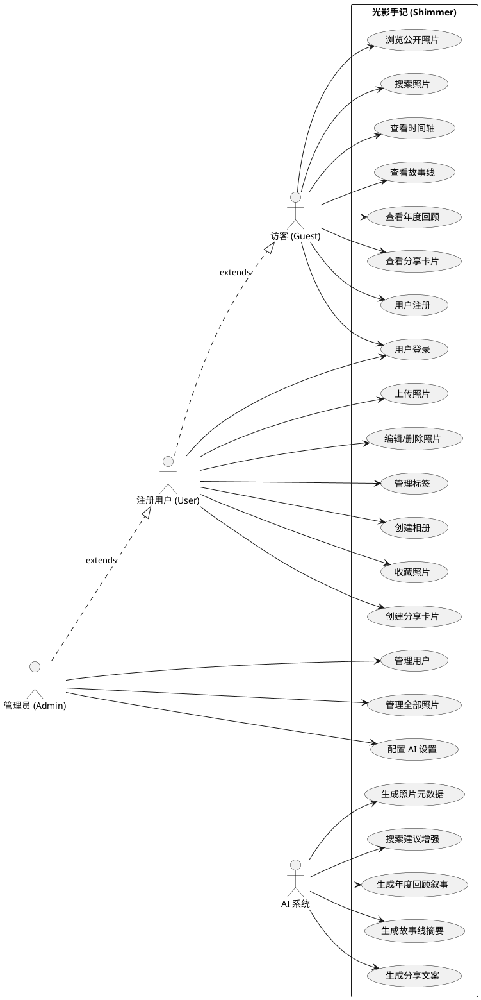
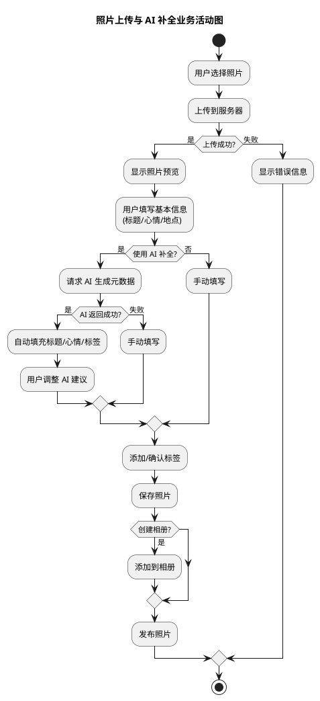
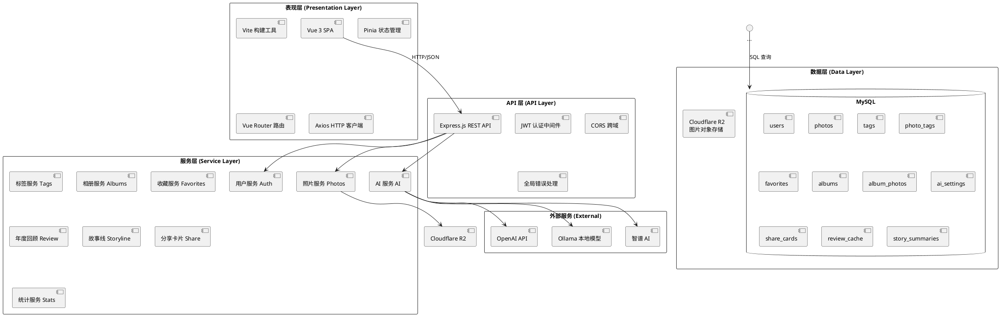
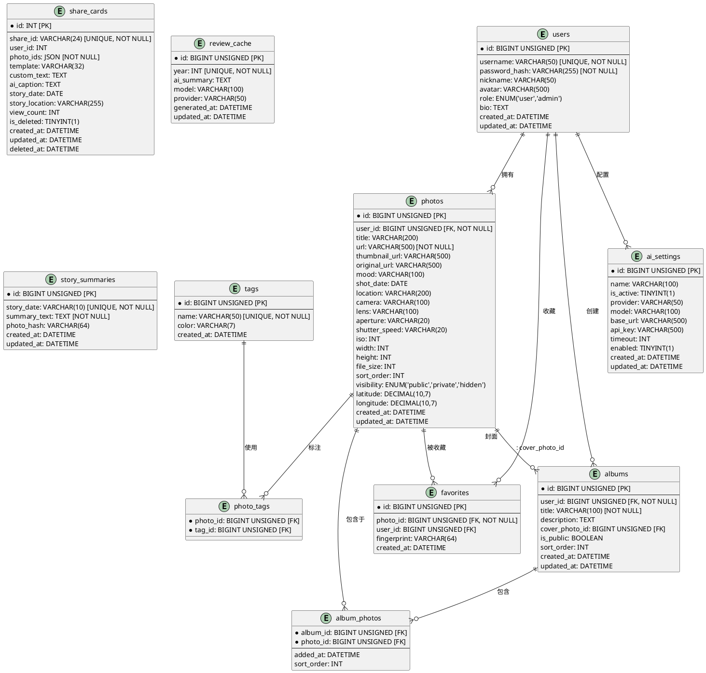
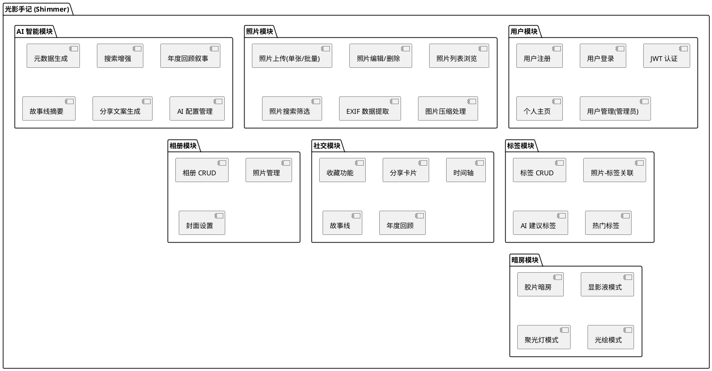

# 2.2 需求分析与概要设计

## 一、需求分析

### 1.1 用户角色

| 角色 | 描述 | 权限范围 |
|------|------|----------|
| 访客 (Guest) | 未登录用户 | 浏览公开照片、搜索、查看时间轴/故事线/年度回顾/分享卡片 |
| 注册用户 (User) | 已登录用户 | 访客权限 + 上传/编辑/删除自己的照片、创建相册、收藏、创建分享卡片、配置 AI |
| 管理员 (Admin) | 拥有管理权限的用户 | 用户权限 + 管理所有照片、用户管理、系统设置 |

### 1.2 功能需求

| 编号 | 功能模块 | 功能描述 | 优先级 | 角色 |
|------|----------|----------|--------|------|
| F1 | 用户认证 | 用户注册、登录、获取当前用户信息、修改密码 | 高 | 全部 |
| F2 | 照片管理 | 上传（单张/批量）、编辑、删除照片 | 高 | 用户/管理员 |
| F3 | 照片浏览 | 瀑布流展示、搜索、按标签/年份/月份筛选 | 高 | 全部 |
| F4 | AI 元数据 | 自动生成照片标题、心情描述、标签建议 | 中 | 用户/管理员 |
| F5 | AI 搜索增强 | 输入时智能推荐搜索关键词和标签 | 中 | 全部 |
| F6 | 标签系统 | 创建/管理标签、为照片添加标签、按标签筛选 | 高 | 全部（创建需登录） |
| F7 | 相册管理 | 创建/编辑/删除相册、添加/移除照片、设置封面 | 中 | 用户/管理员 |
| F8 | 收藏功能 | 收藏/取消收藏照片、查看收藏列表 | 中 | 全部（添加需登录或指纹） |
| F9 | 时间轴 | 按年份/月份分组浏览照片 | 低 | 全部 |
| F10 | 故事线 | 按年月+地点聚合照片展示，AI 生成叙事摘要 | 低 | 全部 |
| F11 | 年度回顾 | 年度统计数据展示，AI 生成年度叙事 | 低 | 全部 |
| F12 | 分享卡片 | 生成可分享的照片卡片（四种模板），AI 生成文案 | 低 | 用户/管理员 |
| F13 | 用户系统 | 个人主页、资料编辑、用户管理（管理员） | 中 | 全部 |
| F14 | AI 设置 | AI 服务提供商/模型/API Key 配置，多预设管理 | 中 | 管理员 |
| F15 | 暗房模式 | 私密照片空间，提供四种沉浸式浏览模式 | 低 | 用户/管理员 |

### 1.3 非功能需求

| 编号 | 需求类型 | 需求描述 |
|------|----------|----------|
| NF1 | 性能 | 图片上传后应在 3 秒内完成压缩处理 |
| NF2 | 性能 | 照片列表 API 响应时间不超过 500ms（100 条以内） |
| NF3 | 安全 | 密码使用 bcrypt 加密存储 |
| NF4 | 安全 | JWT 令牌认证，令牌有效期 7 天 |
| NF5 | 安全 | 用户只能操作自己的照片，管理员可操作全部 |
| NF6 | 可用性 | 前端响应式设计，适配桌面端和移动端 |
| NF7 | 可用性 | 支持暗色模式切换 |
| NF8 | 可扩展 | AI 服务支持多 provider 切换（OpenAI/Ollama/智谱） |
| NF9 | 可扩展 | 图片存储支持本地和 Cloudflare R2 |

### 1.4 用例图

### 1.5 业务活动图（照片上传与 AI 补全流程）

## 二、概要设计

### 2.1 系统架构

### 2.2 ER 图（数据库设计）

### 2.3 功能模块分解

### 2.4 数据库表清单

| 表名 | 引擎 | 说明 | 核心字段 |
|------|------|------|----------|
| `users` | InnoDB | 用户表 | id, username, password_hash, nickname, avatar, role, bio |
| `photos` | InnoDB | 照片表 | id, user_id, title, url, thumbnail_url, mood, shot_date, location, visibility, camera, lens, aperture, shutter_speed, iso, latitude, longitude |
| `tags` | InnoDB | 标签表 | id, name (UNIQUE), color |
| `photo_tags` | InnoDB | 照片-标签关联表 | photo_id (FK), tag_id (FK) 复合主键 |
| `favorites` | InnoDB | 收藏表 | id, photo_id (FK), user_id (FK, 可空), fingerprint (访客标识) |
| `albums` | InnoDB | 相册表 | id, user_id (FK), title, description, cover_photo_id (FK), is_public |
| `album_photos` | InnoDB | 相册-照片关联表 | album_id (FK), photo_id (FK) 复合主键, added_at |
| `ai_settings` | InnoDB | AI 配置表 | id, name, is_active, provider, model, base_url, api_key, timeout, enabled |
| `share_cards` | InnoDB | 分享卡片表 | id, share_id (UNIQUE), user_id, photo_ids (JSON), template, custom_text, ai_caption |
| `review_cache` | InnoDB | 年度回顾缓存 | id, year (UNIQUE), ai_summary, model, provider |
| `story_summaries` | InnoDB | 故事线摘要缓存 | id, story_date (UNIQUE), summary_text, photo_hash |
