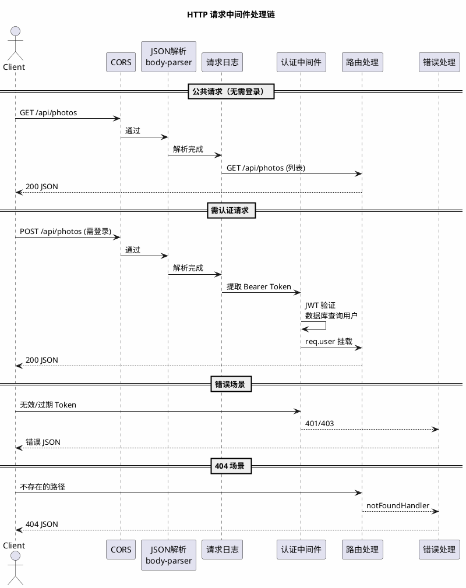
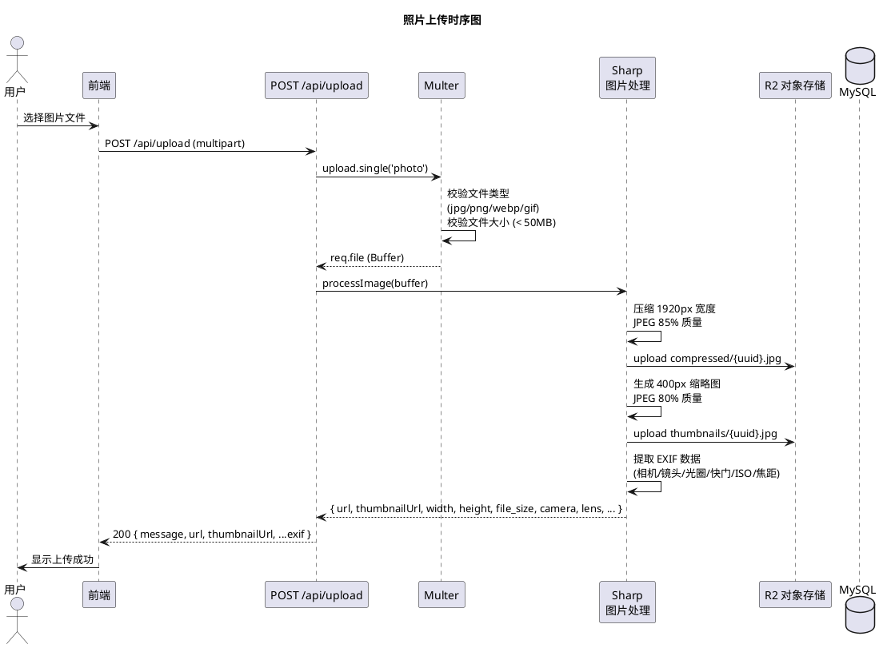
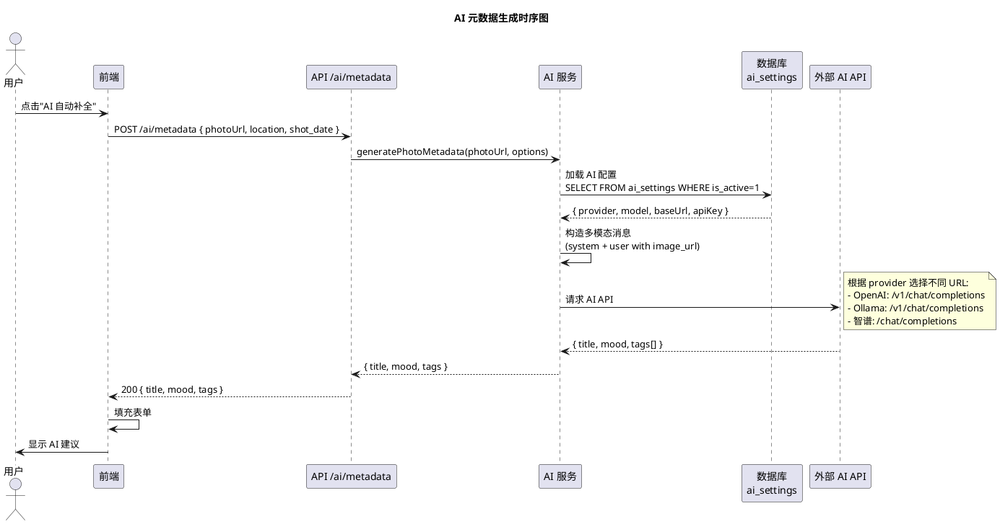
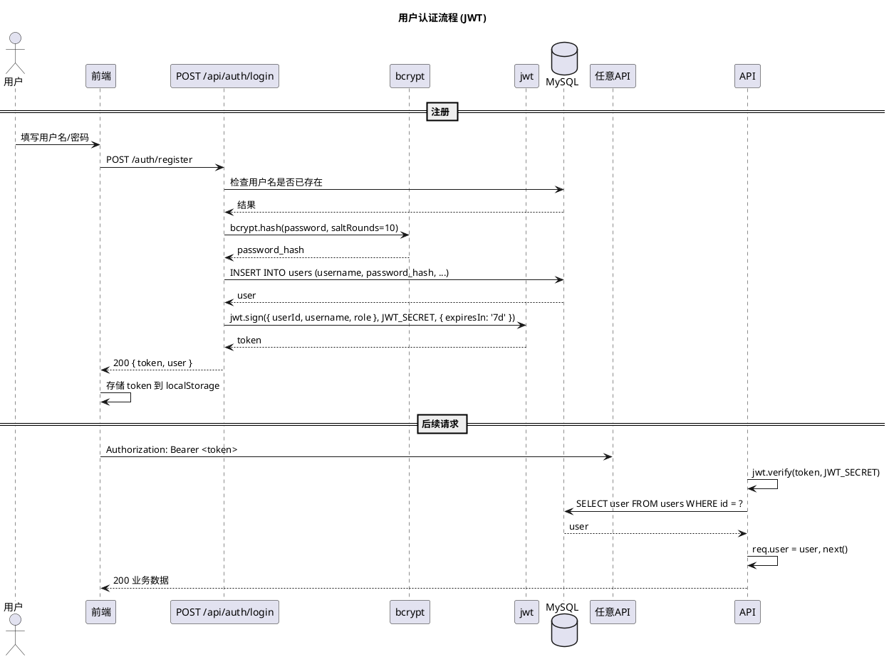

# 2.3 基于 Express.js 框架的服务端系统设计与实现

## 一、目录结构

```
server/
├── src/
│   ├── app.js                   # 应用入口
│   ├── config/
│   │   ├── database.js          # MySQL 连接池
│   │   └── r2.js                # Cloudflare R2 S3 客户端
│   ├── middleware/
│   │   ├── auth.js              # JWT 认证中间件
│   │   └── error.js             # 错误处理中间件
│   ├── routes/
│   │   ├── auth.js              # 认证路由
│   │   ├── photos.js            # 照片路由
│   │   ├── upload.js            # 上传路由
│   │   ├── tags.js              # 标签路由
│   │   ├── albums.js            # 相册路由
│   │   ├── favorites.js         # 收藏路由
│   │   ├── ai.js                # AI 配置路由
│   │   ├── review.js            # 年度回顾路由
│   │   ├── storyline.js         # 故事线路由
│   │   ├── share.js             # 分享卡片路由
│   │   ├── stats.js             # 统计路由
│   │   └── users.js             # 用户路由
│   └── services/
│       └── ai.js                # AI 服务封装
├── database/
│   ├── init.sql                 # 完整数据库初始化
│   └── migrations/              # 数据库迁移脚本
├── .env.example                 # 环境变量模板
└── package.json
```

## 二、中间件链与路由设计

### 2.1 中间件链



### 2.2 路由设计表

| 前缀 | 方法 | 路径 | 认证 | 说明 |
|------|------|------|------|------|
| `/api/auth` | POST | `/login` | 无 | 登录 |
| | POST | `/register` | 无 | 注册 |
| | GET | `/me` | 需登录 | 获取当前用户 |
| | POST | `/change-password` | 需登录 | 修改密码 |
| `/api/photos` | GET | `/` | 可选 | 照片列表（含搜索/筛选） |
| | GET | `/admin/all` | 管理员 | 全部照片 |
| | GET | `/:id` | 可选 | 照片详情 |
| | GET | `/my/list` | 需登录 | 自己的照片 |
| | GET | `/random/diary` | 可选 | 随机照片（暗房） |
| | POST | `/` | 需登录 | 创建照片记录 |
| | PUT | `/:id` | 需登录 | 更新照片 |
| | DELETE | `/:id` | 需登录 | 删除照片 |
| `/api/upload` | POST | `/upload` | 需登录 | 单张上传 |
| | POST | `/upload-multiple` | 需登录 | 批量上传（最多10张） |
| `/api/tags` | GET | `/` | 无 | 全部标签 |
| | GET | `/popular` | 无 | 热门标签 |
| | POST | `/` | 需登录 | 创建标签 |
| | DELETE | `/:id` | 需登录 | 删除标签 |
| | GET | `/photo/:photoId` | 无 | 照片的标签 |
| | POST | `/photo/:photoId` | 需登录 | 设置照片标签 |
| `/api/albums` | GET | `/` | 可选 | 相册列表 |
| | GET | `/:id` | 可选 | 相册详情 |
| | POST | `/` | 需登录 | 创建相册 |
| | PUT | `/:id` | 需登录 | 更新相册 |
| | DELETE | `/:id` | 需登录 | 删除相册 |
| | POST | `/:id/photos` | 需登录 | 添加照片 |
| | DELETE | `/:id/photos/:photoId` | 需登录 | 移除照片 |
| | PUT | `/:id/cover` | 需登录 | 设置封面 |
| `/api/favorites` | GET | `/` | 可选 | 收藏列表 |
| | GET | `/check` | 可选 | 检查收藏状态 |
| | POST | `/` | 需登录 | 添加收藏 |
| | DELETE | `/:photo_id` | 需登录 | 取消收藏 |
| `/api/ai` | GET | `/config` | 无 | AI 配置 |
| | POST | `/config` | 管理员 | 保存配置 |
| | POST | `/metadata` | 无 | 生成元数据 |
| | GET | `/search` | 无 | 搜索建议 |
| | GET | `/presets` | 管理员 | AI 预设列表 |
| | POST | `/presets` | 管理员 | 创建预设 |
| | PUT | `/presets/:id` | 管理员 | 更新预设 |
| | DELETE | `/presets/:id` | 管理员 | 删除预设 |
| `/api/review` | GET | `/years` | 无 | 有照片的年份 |
| | GET | `/:year` | 无 | 年度回顾 |
| `/api/storylines` | GET | `/` | 无 | 故事线列表 |
| | GET | `/:date/:location` | 无 | 故事详情 |
| | POST | `/:date/:location/summary` | 无 | 生成摘要 |
| `/api/share` | POST | `/` | 无 | 创建分享卡 |
| | GET | `/:shareId` | 无 | 获取分享卡 |
| | DELETE | `/:shareId` | 无 | 删除分享卡 |
| `/api/users` | GET | `/:id` | 无 | 用户主页 |
| | GET | `/:id/photos` | 无 | 用户照片 |
| | PUT | `/profile` | 需登录 | 更新资料 |
| | GET | `/` | 管理员 | 用户列表 |
| | PUT | `/:id/role` | 管理员 | 修改角色 |
| `/api/stats` | GET | `/` | 无 | 站点统计 |

## 三、关键模块实现

### 3.1 应用入口 (app.js)


### 3.2 数据库连接 (config/database.js)


### 3.3 认证中间件 (middleware/auth.js)


### 3.4 照片上传与处理 (routes/upload.js)



**核心图片处理代码：**


### 3.5 AI 服务架构 (services/ai.js)



**AI 多 Provider 适配核心代码：**


### 3.6 认证流程



### 3.7 错误处理中间件 (middleware/error.js)

错误处理中间件采用自定义错误类（`AppError`、`ValidationError`）与全局错误处理器相结合的方式，统一捕获和格式化 API 错误响应。核心逻辑包括：区分可操作错误与内部错误、处理 MySQL 重复键/外键异常、生产环境隐藏错误细节。

## 四、环境变量配置

| 变量 | 默认值 | 说明 |
|------|--------|------|
| `DB_HOST` | `localhost` | MySQL 主机 |
| `DB_PORT` | `3306` | MySQL 端口 |
| `DB_USER` | `root` | MySQL 用户 |
| `DB_PASSWORD` | — | MySQL 密码 |
| `DB_NAME` | `shimmer` | 数据库名 |
| `JWT_SECRET` | — | JWT 签名密钥 |
| `JWT_EXPIRES_IN` | `7d` | JWT 有效期 |
| `PORT` | `3000` | 服务端口 |
| `FRONTEND_URL` | `http://localhost:5173` | CORS 允许的前端地址 |
| `UPLOAD_DIR` | `uploads` | 本地上传目录 |
| `R2_ENDPOINT` | — | Cloudflare R2 端点 |
| `R2_ACCESS_KEY_ID` | — | R2 访问密钥 |
| `R2_SECRET_ACCESS_KEY` | — | R2 秘密密钥 |
| `R2_BUCKET_NAME` | `shimmer` | R2 存储桶 |
| `AI_PROVIDER` | — | AI 提供商 (ollama/zhipu/openai) |
| `AI_MODEL` | — | AI 模型名 |
| `AI_BASE_URL` | — | AI API 地址 |
| `AI_API_KEY` | — | AI API 密钥 |
| `AI_TIMEOUT` | `120000` | AI 请求超时 (ms) |

## 五、接口测试

### 5.1 测试用例清单

| 编号 | 模块 | 测试名称 | 方法 | 路径 | 预期结果 |
|------|------|----------|------|------|----------|
| TC01 | 用户认证 | 用户注册 | POST | `/api/auth/register` | 201，返回 token |
| TC02 | 用户认证 | 重复注册 | POST | `/api/auth/register` | 409，用户名已存在 |
| TC03 | 用户认证 | 正确登录 | POST | `/api/auth/login` | 200，返回 JWT |
| TC04 | 用户认证 | 错误密码 | POST | `/api/auth/login` | 401，密码错误 |
| TC05 | 用户认证 | 获取当前用户 | GET | `/api/auth/me` | 200，返回用户信息 |
| TC06 | 标签 | 标签列表 | GET | `/api/tags` | 200，全部标签 |
| TC07 | 标签 | 创建标签 | POST | `/api/tags` | 201，返回标签 |
| TC08 | 标签 | 热门标签 | GET | `/api/tags/popular` | 200，TOP5 |
| TC09 | 标签 | 获取照片标签 | GET | `/api/tags/photo/:id` | 200，标签数组 |
| TC10 | 标签 | 设置照片标签 | POST | `/api/tags/photo/:id` | 200，成功 |
| TC11 | 照片 | 创建照片 | POST | `/api/photos` | 201，返回照片 |
| TC12 | 照片 | 照片列表 | GET | `/api/photos` | 200，照片数组 |
| TC13 | 照片 | 照片详情 | GET | `/api/photos/:id` | 200，含作者 |
| TC14 | 照片 | 更新照片 | PUT | `/api/photos/:id` | 200，更新后对象 |
| TC15 | 照片 | 删除照片 | DELETE | `/api/photos/:id` | 200，成功 |
| TC16 | 相册 | 创建相册 | POST | `/api/albums` | 201，返回相册 |
| TC17 | 相册 | 添加照片 | POST | `/api/albums/:id/photos` | 200，成功 |
| TC18 | 相册 | 相册列表 | GET | `/api/albums` | 200，相册数组 |
| TC19 | 相册 | 相册详情 | GET | `/api/albums/:id` | 200，含照片 |
| TC20 | 收藏 | 添加收藏 | POST | `/api/favorites` | 201，成功 |
| TC21 | 收藏 | 检查收藏 | GET | `/api/favorites/check` | 200，状态 |
| TC22 | 收藏 | 取消收藏 | DELETE | `/api/favorites/:photo_id` | 200，成功 |
| TC23 | 权限 | 未登录创建 | POST | `/api/photos` | 401，未登录 |
| TC24 | 权限 | 无效令牌 | POST | `/api/photos` | 401/403 |
| TC25 | 权限 | 普通用户管理 | GET | `/api/users` | 403，需管理员 |
| TC26 | 统计 | 站点统计 | GET | `/api/stats` | 200，概览 |
| TC27 | 分享 | 创建分享卡 | POST | `/api/share` | 201，share_id |
| TC28 | 分享 | 获取分享卡 | GET | `/api/share/:shareId` | 200，卡片数据 |
| TC29 | 故事线 | 故事线列表 | GET | `/api/storylines` | 200，聚合故事 |
| TC30 | 年度回顾 | 年份列表 | GET | `/api/review/years` | 200，有照片的年份 |

### 5.2 自动测试脚本

执行方式：

```bash
# 后端启动后，在项目根目录运行
node docs/tests/api-test.mjs
```

> 请在此处插入测试执行结果截图（`docs/images/postman-test-results.png`）
>
> 
