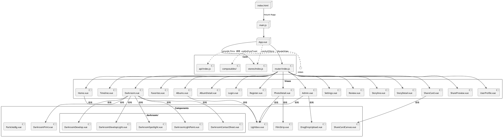
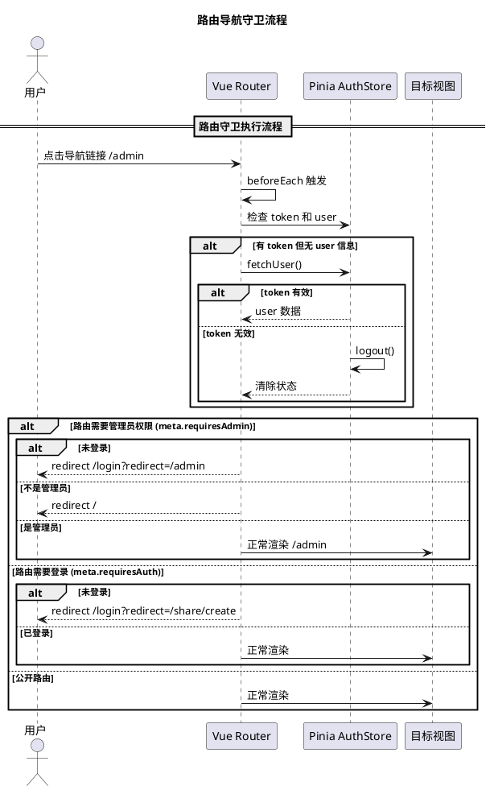
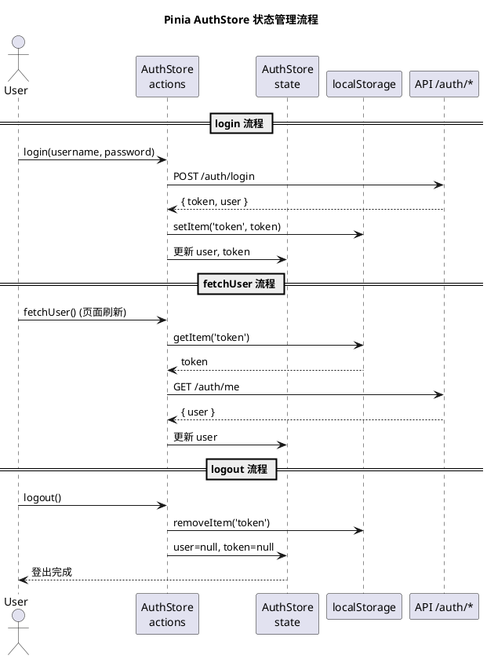
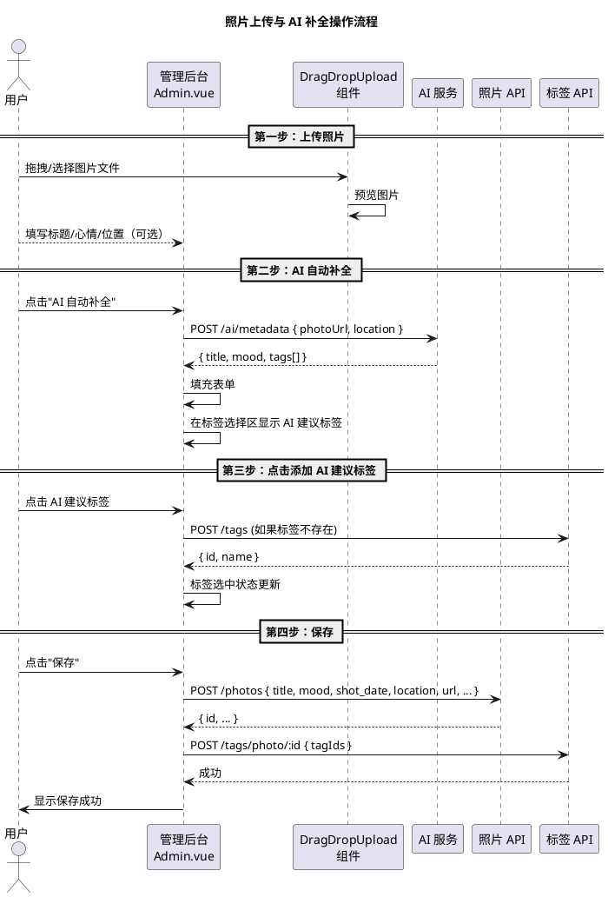

# 2.4 基于 Vue.js 框架的客户端系统设计与实现

## 一、目录结构

```
frontend/
├── index.html                    # HTML 入口
├── vite.config.js                # Vite 配置
├── package.json
├── src/
│   ├── main.js                   # Vue 应用入口
│   ├── App.vue                   # 根组件
│   ├── api/
│   │   ├── index.js              # Axios 实例 + 全部 API 封装
│   │   └── albums.js             # 相册 API
│   ├── router/
│   │   └── index.js              # Vue Router 路由配置
│   ├── stores/
│   │   └── index.js              # Pinia 认证状态管理
│   ├── styles/
│   │   └── dark-mode.css         # 深色模式样式
│   ├── composables/
│   │   ├── useExif.js            # EXIF 数据提取
│   │   └── useToast.js           # 提示通知
│   ├── components/
│   │   ├── DragDropUpload.vue    # 拖拽上传组件
│   │   ├── Lightbox.vue          # 图片灯箱
│   │   ├── FilmStrip.vue         # 胶片条
│   │   ├── ShareCardCanvas.vue   # 分享卡片画布
│   │   ├── DarkroomPrint.vue     # 暗房冲印
│   │   ├── ParticlesBg.vue       # 粒子背景
│   │   └── darkroom/
│   │       ├── DarkroomDevelop.vue       # 显影模式
│   │       ├── DarkroomDevelopLight.vue  # 显影光效
│   │       ├── DarkroomSpotlight.vue     # 聚光灯模式
│   │       ├── DarkroomLightPaint.vue    # 光绘模式
│   │       └── DarkroomContactSheet.vue  # 样片模式
│   └── views/
│       ├── Home.vue              # 首页
│       ├── Timeline.vue          # 时间轴
│       ├── Darkroom.vue          # 暗房
│       ├── Favorites.vue         # 收藏
│       ├── Albums.vue            # 相册列表
│       ├── AlbumDetail.vue       # 相册详情
│       ├── Login.vue             # 登录
│       ├── Register.vue          # 注册
│       ├── PhotoDetail.vue       # 照片详情
│       ├── Admin.vue             # 管理后台
│       ├── Settings.vue          # AI 设置
│       ├── Review.vue            # 年度回顾
│       ├── Storyline.vue         # 故事线
│       ├── StoryDetail.vue       # 故事详情
│       ├── ShareCard.vue         # 分享卡片创建
│       ├── SharePreview.vue      # 分享卡片预览
│       └── UserProfile.vue       # 用户主页
```

## 二、组件树



## 三、路由配置与守卫



**路由配置 (router/index.js)：**


**路由守卫实现：**

路由守卫在 `beforeEach` 中执行三层检查：
1. **自动恢复登录**——若有 token 无 user，尝试调用 `fetchUser()` 恢复会话，失败则登出
2. **管理员权限**——`requiresAdmin` 路由：未登录重定向到登录页，非管理员重定向到首页
3. **登录检查**——`requiresAuth` 路由：未登录重定向到登录页，带 `redirect` 参数以便登录后返回

## 四、状态管理



**Store 实现 (stores/index.js)：**


## 五、API 封装层

**Axios 实例 (api/index.js)：**


**API 模块示例：**

| 模块 | 文件 | 主要方法 |
|------|------|----------|
| `auth` | `api/index.js` | login, register, getMe, changePassword |
| `photos` | `api/index.js` | list, get, create, update, delete, getMyPhotos, getAdminPhotos |
| `upload` | `api/index.js` | single(file), multiple(files) |
| `tags` | `api/index.js` | list, getPopular, create, delete, getPhotoTags, setPhotoTags |
| `favorites` | `api/index.js` | list, check, add, remove |
| `albums` | `api/albums.js` | list, get, create, update, delete, addPhoto, removePhoto |
| `ai` | `api/index.js` | getConfig, saveConfig, generateMetadata, rewriteSearch, managePresets |
| `storylines` | `api/index.js` | list, getDetail, generateSummary |
| `share` | `api/index.js` | create, get, delete |
| `users` | `api/index.js` | getProfile, getUserPhotos, updateProfile, list, updateRole |
| `stats` | `api/index.js` | get |

## 六、关键页面设计与实现

### 6.1 首页 (Home.vue)

浮动卡片风格照片瀑布流，支持搜索和标签筛选。

**核心功能：**
- 照片列表展示（卡片浮动布局）
- 搜索框（支持 AI 搜索建议）
- 标签筛选器
- 年份/月份快速导航
- 照片点击弹出灯箱

### 6.2 管理后台 (Admin.vue)

照片上传与智能管理界面。

**核心功能：**
- 拖拽上传（DragDropUpload 组件）
- 照片列表（缩略图网格）
- AI 自动补全按钮（一键生成标题/心情/标签）
- AI 建议标签点击添加
- 编辑/删除操作

### 6.3 暗房 (Darkroom.vue)

沉浸式私密照片浏览空间，提供四种浏览模式。

| 模式 | 组件 | 说明 |
|------|------|------|
| 显影模式 | DarkroomDevelop.vue | 胶片显影动画过渡 |
| 显影光效 | DarkroomDevelopLight.vue | 带光效的显影效果 |
| 聚光灯 | DarkroomSpotlight.vue | 聚光灯扫描浏览 |
| 光绘 | DarkroomLightPaint.vue | 光绘画笔交互 |

### 6.4 年度回顾 (Review.vue)

年度数据统计与 AI 叙事。

**核心指标：**
- 总照片数 / 存储空间 / 带 GPS 照片数
- 月度照片分布柱状图
- 热门标签 TOP 10
- 热门地点 TOP 10
- 年度封面照片（Hero 照片）
- AI 生成的年度叙事文字

### 6.5 用户操作流程（照片上传 → AI 补全 → 保存）



## 七、应用入口与挂载


## 八、构建配置


Vite 开发服务器通过代理将 `/api` 和 `/uploads` 请求转发到后端 Express 服务（localhost:3000），实现前后端同域开发，避免跨域问题。

## 九、项目开发工作总结

### 9.1 项目概述

"光影手记 (Shimmer)"是一款基于 AI 的智能照片管理与分享平台，采用前后端分离架构：前端 Vue 3 + Vite + Pinia，后端 Express.js + MySQL，图片存储于 Cloudflare R2，AI 支持 OpenAI/Ollama/智谱三种 provider。

### 9.2 核心工作

**服务端**：搭建了 12 组 RESTful API 路由模块，中间件链采用 CORS → JSON 解析 → 日志 → 认证 → 路由 → 错误处理的流水线设计。图片上传模块通过 Multer → Sharp（1920px 压缩 + 400px 缩略图 + EXIF 提取）→ R2 的全链路处理保证效率。

**AI 深度集成**：通过统一 `makeChatCompletion` 函数抽象三种 AI 服务的 API 差异（OpenAI `/v1/chat/completions`、Ollama 同路径、智谱 `/chat/completions` 无 `/v1`）。实现照片元数据生成（多模态 vision）、年度回顾叙事、故事线摘要、分享文案四大功能。采用 `review_cache` 和 `story_summaries` 表缓存 AI 结果避免重复请求。

**客户端**：构建 17 个视图页面和 10 余个组件，路由三级权限控制（公开/需登录/需管理员），Pinia 全局认证状态管理，Axios 拦截器自动注入 JWT 并统一处理 401。

### 9.3 挑战与解决

1. **图片流水线**：`Multer(memoryStorage) → Sharp(stream) → R2 S3 Client → MySQL` 通过 Promise 链串联，批量上传用 `Promise.all` 并发
2. **AI 多 Provider**：根据 `provider` 类型动态构造 URL，`safeParseJSON` 安全提取非结构化 JSON 响应
3. **缓存策略**：`review_cache`（按 year 唯一）、`story_summaries`（按 story_date 唯一），支持 `regenerate` 参数

### 9.4 不足与改进

- 缺少单元测试和集成测试，后续引入 Vitest + Supertest
- 缺少 Docker 容器化和 CI/CD 流水线
- AI 标签准确率依赖模型能力，可优化 prompt 和后处理规则
- 大数据量下前端性能需虚拟滚动和懒加载优化
